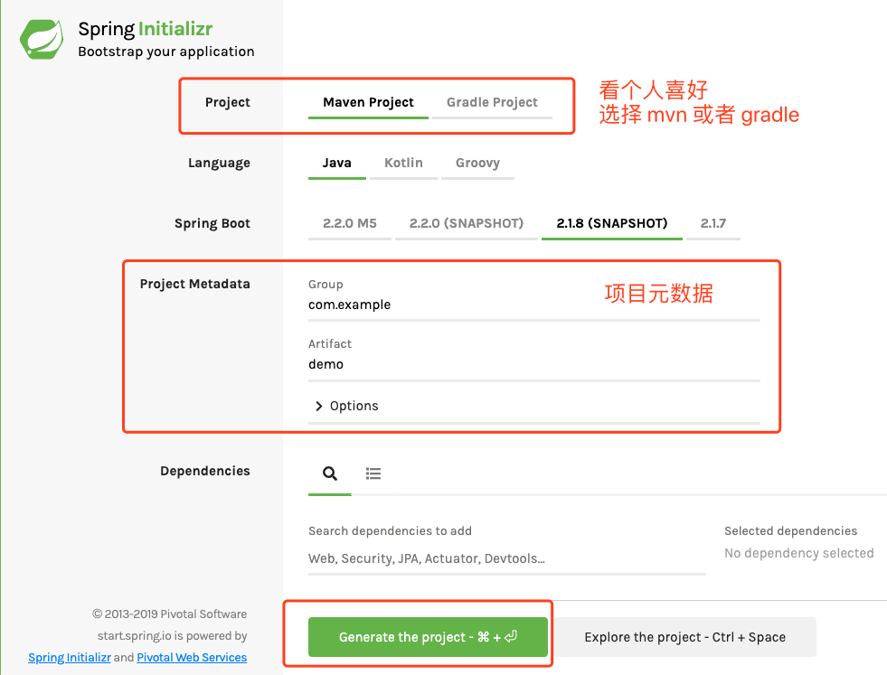
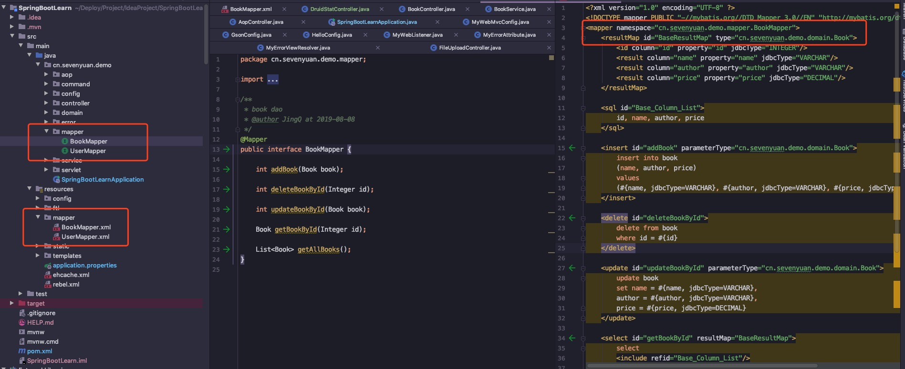
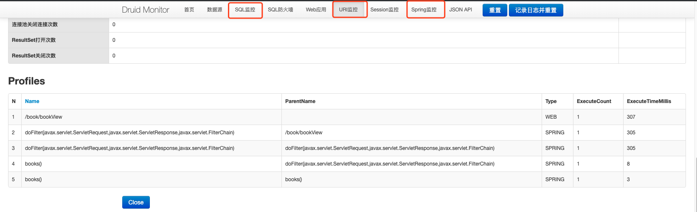

<!-- START doctoc generated TOC please keep comment here to allow auto update -->
<!-- DON'T EDIT THIS SECTION, INSTEAD RE-RUN doctoc TO UPDATE -->
**Table of Contents**  *generated with [DocToc](https://github.com/thlorenz/doctoc)*

- [SpringBoot 速记](#springboot-%E9%80%9F%E8%AE%B0)
  - [构建项目](#%E6%9E%84%E5%BB%BA%E9%A1%B9%E7%9B%AE)
  - [SpringBoot 基础配置](#springboot-%E5%9F%BA%E7%A1%80%E9%85%8D%E7%BD%AE)
  - [Spring Boot Starters](#spring-boot-starters)
  - [@SpringBootApplication](#springbootapplication)
  - [Web 容器配置](#web-%E5%AE%B9%E5%99%A8%E9%85%8D%E7%BD%AE)
    - [常规配置](#%E5%B8%B8%E8%A7%84%E9%85%8D%E7%BD%AE)
    - [HTTPS 配置](#https-%E9%85%8D%E7%BD%AE)
  - [@ConfigurationProperties](#configurationproperties)
  - [Profile](#profile)
  - [@ControllerAdvice 用来处理全局数据](#controlleradvice-%E7%94%A8%E6%9D%A5%E5%A4%84%E7%90%86%E5%85%A8%E5%B1%80%E6%95%B0%E6%8D%AE)
    - [@ExceptionHandler 错误处理](#exceptionhandler-%E9%94%99%E8%AF%AF%E5%A4%84%E7%90%86)
    - [@ModelAttribute 视图属性](#modelattribute-%E8%A7%86%E5%9B%BE%E5%B1%9E%E6%80%A7)
  - [CORS 支持，跨域资源共享](#cors-%E6%94%AF%E6%8C%81%E8%B7%A8%E5%9F%9F%E8%B5%84%E6%BA%90%E5%85%B1%E4%BA%AB)
  - [注册 MVC 拦截器](#%E6%B3%A8%E5%86%8C-mvc-%E6%8B%A6%E6%88%AA%E5%99%A8)
  - [开启 AOP 切面控制](#%E5%BC%80%E5%90%AF-aop-%E5%88%87%E9%9D%A2%E6%8E%A7%E5%88%B6)
  - [整合 Mybatis 和 Druid](#%E6%95%B4%E5%90%88-mybatis-%E5%92%8C-druid)
    - [一、添加 mybatis 和 druid 依赖](#%E4%B8%80%E6%B7%BB%E5%8A%A0-mybatis-%E5%92%8C-druid-%E4%BE%9D%E8%B5%96)
    - [二、配置数据库和连接池参数](#%E4%BA%8C%E9%85%8D%E7%BD%AE%E6%95%B0%E6%8D%AE%E5%BA%93%E5%92%8C%E8%BF%9E%E6%8E%A5%E6%B1%A0%E5%8F%82%E6%95%B0)
    - [三、其他 mybatis 配置](#%E4%B8%89%E5%85%B6%E4%BB%96-mybatis-%E9%85%8D%E7%BD%AE)
  - [整合 Redis](#%E6%95%B4%E5%90%88-redis)
    - [一、引用 Redis 依赖](#%E4%B8%80%E5%BC%95%E7%94%A8-redis-%E4%BE%9D%E8%B5%96)
    - [二、参数配置](#%E4%BA%8C%E5%8F%82%E6%95%B0%E9%85%8D%E7%BD%AE)
    - [三、代码使用](#%E4%B8%89%E4%BB%A3%E7%A0%81%E4%BD%BF%E7%94%A8)
  - [发送 HTML 样式的邮件](#%E5%8F%91%E9%80%81-html-%E6%A0%B7%E5%BC%8F%E7%9A%84%E9%82%AE%E4%BB%B6)
    - [一、引入依赖](#%E4%B8%80%E5%BC%95%E5%85%A5%E4%BE%9D%E8%B5%96)
    - [二、配置邮箱的参数](#%E4%BA%8C%E9%85%8D%E7%BD%AE%E9%82%AE%E7%AE%B1%E7%9A%84%E5%8F%82%E6%95%B0)
    - [三、写模板和发送内容](#%E4%B8%89%E5%86%99%E6%A8%A1%E6%9D%BF%E5%92%8C%E5%8F%91%E9%80%81%E5%86%85%E5%AE%B9)
  - [整合 Swagger (API 文档)](#%E6%95%B4%E5%90%88-swagger-api-%E6%96%87%E6%A1%A3)
    - [一、引入依赖](#%E4%B8%80%E5%BC%95%E5%85%A5%E4%BE%9D%E8%B5%96-1)
    - [二、配置 Swagger 参数](#%E4%BA%8C%E9%85%8D%E7%BD%AE-swagger-%E5%8F%82%E6%95%B0)
  - [总结](#%E6%80%BB%E7%BB%93)
  - [参考资料](#%E5%8F%82%E8%80%83%E8%B5%84%E6%96%99)

<!-- END doctoc generated TOC please keep comment here to allow auto update -->

# SpringBoot 速记

## 构建项目

相比于使用 `IDEA` 的模板创建项目，我更推荐的是在 `Spring` 官网上选择参数一步生成项目

[https://start.spring.io/](https://start.spring.io/)




我们只需要做的事情，就是修改组织名和项目名，点击 `Generate the project`，下载到本地，然后使用 `IDEA` 打开

这个时候，不需要任何配置，点击 `Application` 类的 `run` 方法就能直接启动项目。

---
## SpringBoot 基础配置

## Spring Boot Starters

**引用自参考资料 1 描述：**

> **starter的理念**：starter 会把所有用到的依赖都给包含进来，避免了开发者自己去引入依赖所带来的麻烦。需要注意的是不同的 starter 是为了解决不同的依赖，所以它们内部的实现可能会有很大的差异，例如 jpa 的 starter 和 Redis 的 starter 可能实现就不一样，这是因为 starter 的本质在于 synthesize，这是一层在逻辑层面的抽象，也许这种理念有点类似于 Docker，因为它们都是在做一个“包装”的操作，如果你知道 Docker 是为了解决什么问题的，也许你可以用 Docker 和 starter 做一个类比。

我们知道在 `SpringBoot` 中很重要的一个概念就是，**「约定优于配置」**，通过特定方式的配置，可以减少很多步骤来实现想要的功能。

例如如果我们想要使用缓存 `Redis`

**在之前的可能需要通过以下几个步骤：**

1. 在 `pom` 文件引入特定版本的 `redis`
2. 在 `.properties` 文件中配置参数
3. 根据参数，新建一个又一个 `jedis` 连接
4. 定义一个工具类，手动创建连接池来管理

经历了上面的步骤，我们才能正式使用 `Redis`

**但在 `Spring Boot` 中，一切因为 `Starter` 变得简单**

1. 在 `pom` 文件中引入 `spring-boot-starter-data-redis`
2. 在 `.properties` 文件中配置参数

通过上面两个步骤，配置自动生效，具体生效的 `bean` 是 `RedisAutoConfiguration`，自动配置类的名字都有一个特点，叫做 `xxxAutoConfiguration`。

可以来简单看下这个类：

```java
@Configuration
@ConditionalOnClass(RedisOperations.class)
@EnableConfigurationProperties(RedisProperties.class)
@Import({ LettuceConnectionConfiguration.class, JedisConnectionConfiguration.class })
public class RedisAutoConfiguration {

	@Bean
	@ConditionalOnMissingBean(name = "redisTemplate")
	public RedisTemplate<Object, Object> redisTemplate(RedisConnectionFactory redisConnectionFactory)
			throws UnknownHostException {
		RedisTemplate<Object, Object> template = new RedisTemplate<>();
		template.setConnectionFactory(redisConnectionFactory);
		return template;
	}

	@Bean
	@ConditionalOnMissingBean
	public StringRedisTemplate stringRedisTemplate(RedisConnectionFactory redisConnectionFactory)
			throws UnknownHostException {
		StringRedisTemplate template = new StringRedisTemplate();
		template.setConnectionFactory(redisConnectionFactory);
		return template;
	}

}

@ConfigurationProperties(prefix = "spring.redis")
public class RedisProperties {...}
```

可以看到，`Redis` 自动配置类，读取了以 `spring.redis` 为前缀的配置，然后加载 `redisTemplate` 到容器中，然后我们在应用中就能使用 `RedisTemplate` 来对缓存进行操作~（还有很多细节没有细说，例如 `@ConditionalOnMissingBean` 先留个坑(●´∀｀●)ﾉ）


```java
@Autowired
private RedisTemplate redisTemplate;

ValueOperations ops2 = redisTemplate.opsForValue();
Book book = (Book) ops2.get("b1");
```

---
## @SpringBootApplication

该注解是加载项目的启动类上的，而且它是一个组合注解：

```java
@SpringBootConfiguration
@EnableAutoConfiguration
@ComponentScan(excludeFilters = { @Filter(type = FilterType.CUSTOM, classes = TypeExcludeFilter.class),
		@Filter(type = FilterType.CUSTOM, classes = AutoConfigurationExcludeFilter.class) })
public @interface SpringBootApplication {...}
```

下面是这三个核心注解的解释：

| 注解名                   | 解释                                                  |
| ------------------------ | ----------------------------------------------------- |
| @SpringBootConfiguration | **表明这是一个配置类，开发者可以在这个类中配置 Bean** |
| @EnableAutoConfiguration | **表示开启自动化配置**                                |
| @ComponentScan           | **完成包扫描，默认扫描的类位于当前类所在包的下面**  |

通过该注解，我们执行 `mian` 方法：

```java
SpringApplication.run(SpringBootLearnApplication.class, args);
```

就可以启动一个 `SpringApplicaiton` 应用了。

---
## Web 容器配置

### 常规配置

| 配置名                             | 解释                                                         |
| ---------------------------------- | ------------------------------------------------------------ |
| server.port=8081                   | **配置了容器的端口号，默认是 8080**                          |
| server.error.path=/error           | **配置了项目出错时跳转的页面**                               |
| server.servlet.session.timeout=30m | **session 失效时间，m 表示分钟，如果不写单位，默认是秒 s**   |
| server.servlet.context-path=/      | **项目名称，不配置时默认为/。配置后，访问时需加上前缀**      |
| server.tomcat.uri-encoding=utf-8   | **Tomcat 请求编码格式**                                      |
| server.tomcat.max-threads=500      | **Tomcat 最大线程数**                                        |
| server.tomcat.basedir=/home/tmp    | **Tomcat 运行日志和临时文件的目录，如不配置，默认使用系统的临时目录** |

### HTTPS 配置

| 配置名                               | 解释           |
| ------------------------------------ | -------------- |
| server.ssl.key-store=xxx             | **秘钥文件名** |
| server.ssl.key-alias=xxx             | **秘钥别名**   |
| server.ssl.key-store-password=123456 | **秘钥密码**   |

想要详细了解如何配置 `HTTPS`，可以参考这篇文章 [Spring Boot 使用SSL-HTTPS](https://zhuanlan.zhihu.com/p/31385073)

---
## @ConfigurationProperties

这个注解可以放在类上或者 `@Bean` 注解所在方法上，这样 `SpringBoot` 就能够从配置文件中，读取特定前缀的配置，将属性值注入到对应的属性。

使用例子：

```java
@Configuration
@ConfigurationProperties(prefix = "spring.datasource")
public class DruidConfigBean {

    private Integer initialSize;

    private Integer minIdle;

    private Integer maxActive;
    
    private List<String> customs;
    
    ...
}
```

`application.properties`

```xml
spring.datasource.initialSize=5
spring.datasource.minIdle=5
spring.datasource.maxActive=20
spring.datasource.customs=test1,test2,test3
```

其中，如果对象是列表结构，可以在配置文件中使用 , 逗号进行分割，然后注入到相应的属性中。

---
## Profile

使用该属性，可以快速切换配置文件，在 `SpringBoot` 默认约定中，不同环境下配置文件名称规则为 `application-{profile}.propertie`，`profile` 占位符表示当前环境的名称。

1、配置 `application.properties`
```xml
spring.profiles.active=dev
```

2、在代码中配置
在启动类的 `main` 方法上添加 `setAdditionalProfiles("{profile}")`;

```java
SpringApplicationBuilder builder = new SpringApplicationBuilder(SpringBootLearnApplication.class);
builder.application().setAdditionalProfiles("prod");
builder.run(args);
```

3、启动参数配置

```linux
java -jar demo.jar --spring.active.profile=dev
```

---
## @ControllerAdvice 用来处理全局数据

`@ControllerAdvice` 是 `@Controller` 的增强版。主要用来处理全局数据，一般搭配 `@ExceptionHandler` 、`@ModelAttribute` 以及 `@InitBinder` 使用。

### @ExceptionHandler 错误处理
```java
/**
 * 加强版控制器，拦截自定义的异常处理
 *
 */
@ControllerAdvice
public class CustomExceptionHandler {
    
    // 指定全局拦截的异常类型，统一处理
    @ExceptionHandler(MaxUploadSizeExceededException.class)
    public void uploadException(MaxUploadSizeExceededException e, HttpServletResponse response) throws IOException {
        response.setContentType("text/html;charset=utf-8");
        PrintWriter out = response.getWriter();
        out.write("上传文件大小超出限制");
        out.flush();
        out.close();
    }
}
```

### @ModelAttribute 视图属性

```java
@ControllerAdvice
public class CustomModelAttribute {
    
    // 
    @ModelAttribute(value = "info")
    public Map<String, String> userInfo() throws IOException {
        Map<String, String> map = new HashMap<>();
        map.put("test", "testInfo");
        return map;
    }
}


@GetMapping("/hello")
public String hello(Model model) {
    Map<String, Object> map = model.asMap();
    Map<String, String> infoMap = (Map<String, String>) map.get("info");
    return infoMap.get("test");
}
```

- `key : @ModelAttribute` 注解中的 `value` 属性
- 使用场景：任何请求 `controller` 类，通过方法参数中的 `Model` 都可以获取 `value` 对应的属性

---
## CORS 支持，跨域资源共享
`CORS（Cross-Origin Resource Sharing）`，跨域资源共享技术，目的是为了解决前端的跨域请求。

> **引用：当一个资源从与该资源本身所在服务器不同的域或端口请求一个资源时，资源会发起一个跨域HTTP请求**

详细可以参考这篇文章-[springboot系列文章之实现跨域请求(CORS)](https://juejin.im/post/5b99dcca6fb9a05d3154f8b7)，这里只是记录一下如何使用：


例如在我的前后端分离 `demo` 中，如果没有通过 `Nginx` 转发，那么将会提示如下信息：

> Access to fetch at 'http://localhost:8888/login' from origin 'http://localhost:3000' has been blocked by CORS policy: Response to preflight request doesn't pass access control check: The value of the 'Access-Control-Allow-Credentials' header in the response is '' which must be 'true' when the request's credentials mode is 'include'

为了解决这个问题，在前端不修改的情况下，需要后端加上如下两行代码：

```java
// 第一行，支持的域
@CrossOrigin(origins = "http://localhost:3000")
@RequestMapping(value = "/login", method = RequestMethod.GET)
@ResponseBody
public String login(HttpServletResponse response) {
    // 第二行，响应体添加头信息（这一行是解决上面的提示）
    response.setHeader("Access-Control-Allow-Credentials", "true");
    return HttpRequestUtils.login();
}
```

---
## 注册 MVC 拦截器

在 `MVC` 模块中，也提供了类似 `AOP` 切面管理的扩展，能够拥有更加精细的拦截处理能力。

核心在于该接口：`HandlerInterceptor`，使用方式如下：


```java
/**
 * 自定义 MVC 拦截器
 */
public class MyInterceptor implements HandlerInterceptor {
    @Override
    public boolean preHandle(HttpServletRequest request, HttpServletResponse response, Object handler) throws Exception {
        // 在 controller 方法之前调用
        return true;
    }

    @Override
    public void postHandle(HttpServletRequest request, HttpServletResponse response, Object handler, ModelAndView modelAndView) throws Exception {
        // 在 controller 方法之后调用
    }

    @Override
    public void afterCompletion(HttpServletRequest request, HttpServletResponse response, Object handler, Exception ex) throws Exception {
        // 在 postHandle 方法之后调用
    }
}
```

注册代码：

```java
/**
 * 全局控制的 mvc 配置
 */
@Configuration
public class MyWebMvcConfig implements WebMvcConfigurer {
    @Override
    public void addInterceptors(InterceptorRegistry registry) {
        registry.addInterceptor(new MyInterceptor())
                // 表示拦截的 URL
                .addPathPatterns("/**")
                // 表示需要排除的路径
                .excludePathPatterns("/hello");
    }
}
```

拦截器执行顺序： `preHandle` ->  `controller` -> `postHandle` -> `afterCompletion`，同时需要注意的是，只有 `preHandle` 方法返回 `true`，后面的方法才会继续执行。

---
## 开启 AOP 切面控制

切面注入是老生常谈的技术，之前学习 `Spring` 时也有了解，可以参考我之前写过的文章参考一下：

[Spring自定义注解实现AOP](https://vip-augus.github.io/2019/03/19/java/Spring%E8%87%AA%E5%AE%9A%E4%B9%89%E6%B3%A8%E8%A7%A3%E5%AE%9E%E7%8E%B0AOP/)

[Spring 源码学习(八) AOP 使用和实现原理](https://vip-augus.github.io/2019/07/17/spring/2019-07-17-spring-analysis-note-8)

在 `SpringBoot` 中，使用起来更加简便，只需要加入该依赖，使用方法与上面一样。

```xml
<dependency>
    <groupId>org.springframework.boot</groupId>
    <artifactId>spring-boot-starter-aop</artifactId>
</dependency>
```

---
## 整合 Mybatis 和 Druid
`SpringBoot` 整合数据库操作，目前主流使用的是 `Druid` 连接池和 `Mybatis` 持久层，同样的，`starter` 提供了简洁的整合方案

项目结构如下：



### 一、添加 mybatis 和 druid 依赖

```xml
 <dependency>
    <groupId>org.mybatis.spring.boot</groupId>
    <artifactId>mybatis-spring-boot-starter</artifactId>
    <version>1.3.2</version>
</dependency>

<dependency>
    <groupId>com.alibaba</groupId>
    <artifactId>druid-spring-boot-starter</artifactId>
    <version>1.1.18</version>
</dependency>
```

### 二、配置数据库和连接池参数

```shell
# 数据库配置
spring.datasource.type=com.alibaba.druid.pool.DruidDataSource
spring.datasource.driver-class-name=com.mysql.cj.jdbc.Driver
spring.datasource.url=jdbc:mysql://127.0.0.1:3306/test?useUnicode=true&characterEncoding=utf8&allowMultiQueries=true
spring.datasource.username=root
spring.datasource.password=12345678

# druid 配置
spring.datasource.druid.initial-size=5
spring.datasource.druid.max-active=20
spring.datasource.druid.min-idle=5
spring.datasource.druid.max-wait=60000
spring.datasource.druid.pool-prepared-statements=true
spring.datasource.druid.max-pool-prepared-statement-per-connection-size=20
spring.datasource.druid.max-open-prepared-statements=20
spring.datasource.druid.validation-query=SELECT 1
spring.datasource.druid.validation-query-timeout=30000
spring.datasource.druid.test-on-borrow=true
spring.datasource.druid.test-on-return=false
spring.datasource.druid.test-while-idle=false
#spring.datasource.druid.time-between-eviction-runs-millis=
#spring.datasource.druid.min-evictable-idle-time-millis=
#spring.datasource.druid.max-evictable-idle-time-millis=10000

# Druid stat filter config
spring.datasource.druid.filters=stat,wall
spring.datasource.druid.web-stat-filter.enabled=true
spring.datasource.druid.web-stat-filter.url-pattern=/*
# session 监控
spring.datasource.druid.web-stat-filter.session-stat-enable=true
spring.datasource.druid.web-stat-filter.session-stat-max-count=10
spring.datasource.druid.web-stat-filter.principal-session-name=admin
spring.datasource.druid.web-stat-filter.principal-cookie-name=admin
spring.datasource.druid.web-stat-filter.profile-enable=true
# stat 监控
spring.datasource.druid.web-stat-filter.exclusions=*.js,*.gif,*.jpg,*.bmp,*.png,*.css,*.ico,/druid/*
spring.datasource.druid.filter.stat.db-type=mysql
spring.datasource.druid.filter.stat.log-slow-sql=true
spring.datasource.druid.filter.stat.slow-sql-millis=1000
spring.datasource.druid.filter.stat.merge-sql=true
spring.datasource.druid.filter.wall.enabled=true
spring.datasource.druid.filter.wall.db-type=mysql
spring.datasource.druid.filter.wall.config.delete-allow=true
spring.datasource.druid.filter.wall.config.drop-table-allow=false

# Druid manage page config
spring.datasource.druid.stat-view-servlet.enabled=true
spring.datasource.druid.stat-view-servlet.url-pattern=/druid/*
spring.datasource.druid.stat-view-servlet.reset-enable=true
spring.datasource.druid.stat-view-servlet.login-username=admin
spring.datasource.druid.stat-view-servlet.login-password=admin
#spring.datasource.druid.stat-view-servlet.allow=
#spring.datasource.druid.stat-view-servlet.deny=
spring.datasource.druid.aop-patterns=cn.sevenyuan.demo.*
```

### 三、其他 mybatis 配置

本地工程，将 `xml` 文件放入 `resources` 资源文件夹下，所以需要加入以下配置，让应用进行识别：

```xml
 <build>
    <resources>
        <resource>
            <directory>src/main/resources</directory>
            <includes>
                <include>**/*</include>
            </includes>
        </resource>
    </resources>
    ...
</build>
```

通过上面的配置，我本地开启了三个页面的监控：`SQL` 、 `URL` 和 `Sprint` 监控，如下图：



**通过上面的配置，SpringBoot 很方便的就整合了 Druid 和 mybatis，同时根据在 `properties` 文件中配置的参数，开启了 `Druid` 的监控。**

但我根据上面的配置，始终开启不了 `session` 监控，所以如果需要配置 `session` 监控或者调整参数具体配置，可以查看官方网站

[alibaba/druid](https://github.com/alibaba/druid/tree/master/druid-spring-boot-starter)

---
## 整合 Redis
我用过 `Redis` 和 `NoSQL`，但最熟悉和常用的，还是 `Redis` ，所以这里记录一下如何整合

### 一、引用 Redis 依赖

```xml
<dependency>
    <groupId>org.springframework.boot</groupId>
    <artifactId>spring-boot-starter-data-redis</artifactId>
    <exclusions>
        <exclusion>
            <artifactId>lettuce-core</artifactId>
            <groupId>io.lettuce</groupId>
        </exclusion>
    </exclusions>
</dependency>

<dependency>
    <groupId>redis.clients</groupId>
    <artifactId>jedis</artifactId>
</dependency>
```

### 二、参数配置

```shell
# redis 配置
spring.redis.database=0
spring.redis.host=localhost
spring.redis.port=6379
spring.redis.password=
spring.redis.jedis.pool.max-active=8
spring.redis.jedis.pool.max-idle=8
spring.redis.jedis.pool.max-wait=-1ms
spring.redis.jedis.pool.min-idle=0
```

### 三、代码使用

```java
@Autowired
private RedisTemplate redisTemplate;

@Autowired
private StringRedisTemplate stringRedisTemplate;

@GetMapping("/testRedis")
public Book getForRedis() {
    ValueOperations<String, String> ops1 = stringRedisTemplate.opsForValue();
    ops1.set("name", "Go 语言实战");
    String name = ops1.get("name");
    System.out.println(name);
    ValueOperations ops2 = redisTemplate.opsForValue();
    Book book = (Book) ops2.get("b1");
    if (book == null) {
        book = new Book("Go 语言实战", 2, "none name", BigDecimal.ONE);
        ops2.set("b1", book);
    }
    return book;
}
```

这里只是简单记录引用和使用方式，更多功能可以看这里：[Spring Data Redis（一）--解析RedisTemplate](https://www.cnkirito.moe/spring-data-redis-1/)

---
## 发送 HTML 样式的邮件

之前也使用过，所以可以参考这篇文章：[Java整合Spring发送邮件](https://vip-augus.github.io/2018/07/30/java/Java%E6%95%B4%E5%90%88Spring%E5%8F%91%E9%80%81%E9%82%AE%E4%BB%B6/)

### 一、引入依赖

```xml
 <!-- mail -->
<dependency>
    <groupId>org.springframework.boot</groupId>
    <artifactId>spring-boot-starter-mail</artifactId>
</dependency>

<dependency>
    <groupId>org.springframework.boot</groupId>
    <artifactId>spring-boot-starter-thymeleaf</artifactId>
</dependency>
```

### 二、配置邮箱的参数

```shell
# mail
spring.mail.host=smtp.qq.com
spring.mail.port=465
spring.mail.username=xxxxxxxx
spring.mail.password=xxxxxxxx
spring.mail.default-encoding=UTF-8
spring.mail.properties.mail.smtp.socketFactory.class=javax.net.ssl.SSLSocketFactory
spring.mail.properties.mail.debug=true
```

如果使用的是 `QQ` 邮箱，需要在邮箱的设置中获取授权码，填入上面的 `password` 中

### 三、写模板和发送内容

`MailServiceImpl.java`

```java
@Autowired
private JavaMailSender javaMailSender;

@Override
public void sendHtmlMail(String from, String to, String subject, String content) {
    try {
        MimeMessage message = javaMailSender.createMimeMessage();
        MimeMessageHelper helper = new MimeMessageHelper(message, true);
        helper.setFrom(from);
        helper.setTo(to);
        helper.setSubject(subject);
        helper.setText(content, true);
        javaMailSender.send(message);
    } catch (MessagingException e) {
        System.out.println("发送邮件失败");
        log.error("发送邮件失败", e);
    }
}
```

`mailtemplate.html`

```html
<!DOCTYPE html>
<html lang="en" xmlns:th="http://www.thymeleaf.org">
<head>
    <meta charset="UTF-8">
    <title>邮件</title>
</head>
<body>
<div th:text="${subject}"></div>
<div>书籍清单
    <table border="1">
        <tr>
            <td>图书编号</td>
            <td>图书名称</td>
            <td>图书作者</td>
        </tr>
        <tr th:each="book:${books}">
            <td th:text="${book.id}"></td>
            <td th:text="${book.name}"></td>
            <td th:text="${book.author}"></td>
        </tr>
    </table>
</div>
</body>
</html>
```

`test.java`

```java

@Autowired
private MailService mailService;

@Autowired
private TemplateEngine templateEngine;
    
@Test
public void sendThymeleafMail() {
    Context context = new Context();
    context.setVariable("subject", "图书清册");
    List<Book> books = Lists.newArrayList();
    books.add(new Book("Go 语言基础", 1, "nonename", BigDecimal.TEN));
    books.add(new Book("Go 语言实战", 2, "nonename", BigDecimal.TEN));
    books.add(new Book("Go 语言进阶", 3, "nonename", BigDecimal.TEN));
    context.setVariable("books", books);
    String mail = templateEngine.process("mailtemplate.html", context);
    mailService.sendHtmlMail("xxxx@qq.com", "xxxxxxxx@qq.com", "图书清册", mail);
}
```

通过上面简单步骤，就能够在代码中发送邮件，例如我们每周要写周报，统计系统运行状态，可以设定定时任务，统计数据，然后自动化发送邮件。

---
## 整合 Swagger (API 文档)

### 一、引入依赖

```xml
<!-- swagger -->
<dependency>
    <groupId>io.springfox</groupId>
    <artifactId>springfox-swagger2</artifactId>
    <version>2.9.2</version>
</dependency>

<dependency>
    <groupId>io.springfox</groupId>
    <artifactId>springfox-swagger-ui</artifactId>
    <version>2.9.2</version>
</dependency>
```

### 二、配置 Swagger 参数

`SwaggerConfig.java`

```java
@Configuration
@EnableSwagger2
@EnableWebMvc
public class SwaggerConfig {

    @Bean
    Docket docket() {
        return new Docket(DocumentationType.SWAGGER_2)
                .select()
                .apis(RequestHandlerSelectors.basePackage("cn.sevenyuan.demo.controller"))
                .paths(PathSelectors.any())
                .build().apiInfo(
                        new ApiInfoBuilder()
                                .description("Spring Boot learn project")
                                .contact(new Contact("JingQ", "https://github.com/vip-augus", "=-=@qq.com"))
                                .version("v1.0")
                                .title("API 测试文档")
                                .license("Apache2.0")
                                .licenseUrl("http://www.apache.org/licenese/LICENSE-2.0")
                                .build());

    }
}
```

设置页面 `UI`

```java
@Configuration
@EnableRedisHttpSession(maxInactiveIntervalInSeconds = 60)
public class MyWebMvcConfig implements WebMvcConfigurer {

    @Override
    public void addResourceHandlers(ResourceHandlerRegistry registry) {
        registry.addResourceHandler("swagger-ui.html")
                .addResourceLocations("classpath:/META-INF/resources/");

        registry.addResourceHandler("/webjars/**")
                .addResourceLocations("classpath:/META-INF/resources/webjars/");
    }
}
```

通过这样就能够识别 `@ApiOperation` 等接口标志，在网页查看 `API` 文档，参考文档：[Spring Boot实战：集成Swagger2](https://www.cnblogs.com/paddix/p/8204916.html)

---
## 总结

这边总结的整合经验，只是很基础的配置，在学习的初期，秉着先跑起来，然后不断完善和精进学习。

而且单一整合很容易，但多个依赖会出现想不到的错误，所以在解决环境问题时遇到很多坑，想要使用基础的脚手架，可以尝试跑我上传的项目。

数据库脚本在 `resources` 目录的 `test.sql` 文件中

**同时，这篇文章中有很多技术没有归纳到，想要深入学习的，请关注松哥的《Spring Boot + Vue 全栈开发》**


---
## 参考资料

1、[Spring Boot Starters](https://www.nosuchfield.com/2017/10/15/Spring-Boot-Starters/)

2、[Spring Boot 使用SSL-HTTPS](https://zhuanlan.zhihu.com/p/31385073)

3、[Spring Boot（07）——ConfigurationProperties介绍](https://www.iteye.com/blog/elim-2434028)

4、[springboot系列文章之实现跨域请求(CORS)](https://juejin.im/post/5b99dcca6fb9a05d3154f8b7)

5、[Spring Data Redis（一）--解析RedisTemplate](https://www.cnkirito.moe/spring-data-redis-1/)

6、[Spring Boot实战：集成Swagger2](https://www.cnblogs.com/paddix/p/8204916.html)


